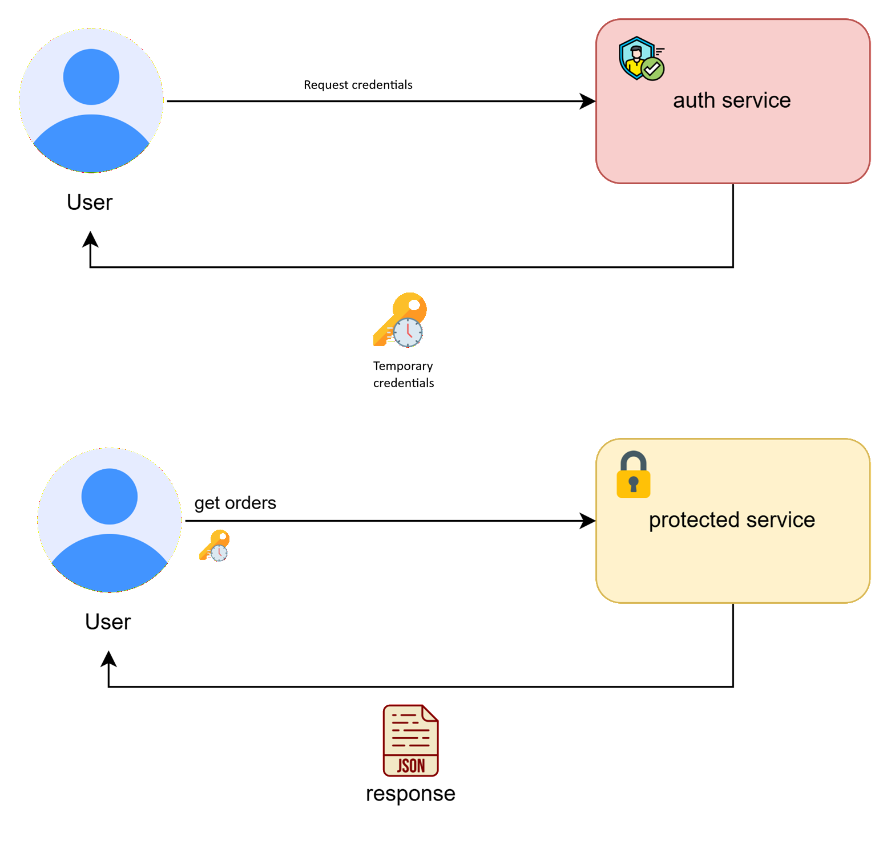
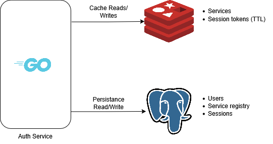
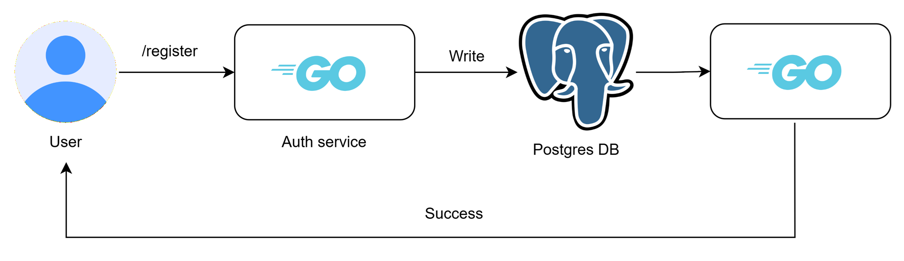
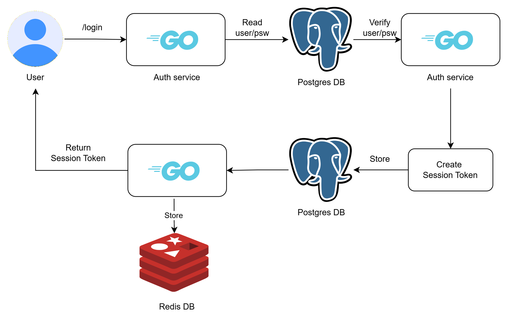
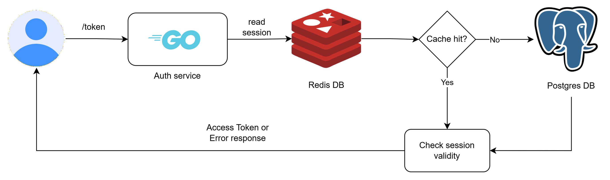
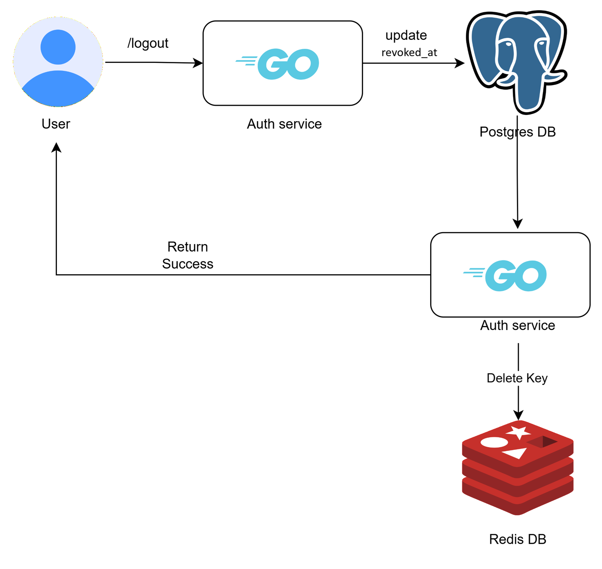

# Docs
In this document it is shown the main design architectural choices for this homework.

## 1. Overview

The objective of this assignment is to design and implement an auth service that returns temporary credentials to access protected services.

This project implements a distributed authentication system composed of two independent services:
* **Auth Service**: responsible for user identity management, authentication and temporary credential generation, necessary to access the protected service.
* **Protected Service**: exposes a protected business resource and validates temporary credentials before granting access, without directly managing user credentials.




The system follows a microservice-oriented architecture where authentication responsibilities are centralized in the Auth Service, while protected services remain independent and stateless: the protected service can independently validate user credentials without reaching the auth service again.


## 2. Authentication

Authentication takes place in the auth service. After the users succesfully register and log in, they can ask for access to a specific protected service. They will be granted access to such protected service through temporary credentials.
Such credentials will be verified by the protected service without managing user credentials (such as usernames and passwords), which is responsibility of the auth-service.

For this project, two types of temporary credentials have been implemented to handle the user session:
1. Opaque tokens (session token)
2. JWT tokens (access token)

Opaque tokens are generated and returned to the user after its successful login. They are stateful, and they are characterized by an expiration time. These tokens can be used by the user to generate JWT tokens (access tokens) for a specific service.

The JWT tokens for this project are stateless, so no info about them is stored anywhere, and are designed to have a short time to live. 

### 2.1 Session Tokens
As mentioned, session tokens are opaque tokens generated after the user succesful login. They are stored (hashed) in a database, along with id, user id and expiration time associated.

TODO: immagine di session token ritornato dopo log in: mostrare utente con credenziali inviate all'auth service, il quale risponde come sopra con session token di 24h

Every time the user asks for a new access token, the auth services checks against the database whether the user session token is valid and not expired. If the session token is expired a 401 status code is sent back. This means that in a real application user should log in to get a new session token.

Session tokens can also be revoked, for example when the user logs out. This updates the *expires_at* attribute associated to the session.

### 2.2 Access Tokens
Access tokens are JWT stateless tokens: no info about them is stored anywhere. They are characterized by a short time to live, and they are generated by the auth service when the user asks to access a specific protected service.

TODO: immagine di access token ritornato dopo /token: mostrare utente con session token inviato all'auth service, il quale risponde come sopra con access token di 5min

The auth service generates JWT access tokens and signs them using RSA asymmetric signing (RS256). The token contains standard registered claims used by protected services to validate the authenticity, origin and validity period of the token.

| Claim                   | Description                                     | Usage                                                                                                    |
| ----------------------- | ----------------------------------------------- | -------------------------------------------------------------------------------------------------------- |
| `iss` (Issuer)          | Identifies the entity that issued the token.    | Used by protected services to verify that the token was generated by the trusted **authentication service**. |
| `sub` (Subject)         | Identifies the entity represented by the token. | Contains the user identifier associated with the authenticated session.                                  |
| `aud` (Audience)        | Identifies the intended recipient of the token. | Ensures that a token generated for a specific service cannot be used against another service.            |
| `exp` (Expiration Time) | Defines when the token becomes invalid.         | Prevents the use of expired access tokens.                                                               |
| `iat` (Issued At)       | Defines when the token was created.             | Provides information about token creation time and helps with token lifecycle management.                |

Example payload:

```json
{
  "iss": "auth-service",
  "sub": "123",
  "aud": [
    "orders-service"
  ],
  "exp": 1750000000,
  "iat": 1749999700
}
```


The protected service validates the token by checking the RSA signature with the **public key** and verifying the registered claims before allowing access to protected resources.

If we had multiple services, we would use the same public key for all of them, as sharing a public key is not a security problem as sharing the same private key (this would happen if symmetric signing would be used).


### 2.3 Additional Notes

Using RSA asymmetric cryptography allows protected services to validate JWT access tokens without exposing the private signing key. Unlike symmetric algorithms, where the same secret key must be shared across multiple services, only the public key is distributed. This significantly reduces the impact of a potential key compromise, as protected services are never able to issue valid tokens themselves.

This approach also improves scalability by allowing each protected service to validate access tokens locally. As a result, no additional network calls to the authentication service are required for every protected request, reducing latency and avoiding unnecessary coupling between services.

TODO: immagine del servizio che verifica il token con la chiave PUBBLICA

One trade-off of this design is that a JWT may remain valid for a short period even after the corresponding session has expired or been revoked. In this implementation, access tokens have a short lifetime (5 minutes), limiting this window of exposure. This compromise is common in stateless authentication systems and enables protected services to operate independently while maintaining a high level of security.

## 3. Data Model
In this section are shown entities and relations involved in the assignment.

### User

Stores user credentials and identity information.

| Column          | Description                                                          |
| --------------- | -------------------------------------------------------------------- |
| `id`            | Unique user identifier.                                              |
| `username`      | Unique username used for authentication.                             |
| `password_hash` | Password hashed using bcrypt. Plain-text passwords are never stored. |
| `created_at`    | Timestamp indicating when the user account was created.              |

---

### Session

Represents an authenticated user session created after a successful login.

| Column               | Description                                                                                                                                          |
| -------------------- | ---------------------------------------------------------------------------------------------------------------------------------------------------- |
| `id`                 | Unique session identifier.                                                                                                                           |
| `user_id`            | Reference to the authenticated user.                                                                                                                 |
| `session_token_hash` | Hash of the session token presented by the client. |
| `created_at`         | Timestamp when the session was created.                                                                                                              |
| `expires_at`         | Session expiration timestamp. Once expired, the session can no longer be used to obtain new access tokens.                                           |
| `revoked_at`         | Optional timestamp indicating that the session has been explicitly revoked before its natural expiration.                                            |

---

### Service Registry

Defines the services that are authorized to receive JWT access tokens from the Authentication Service.

| Column         | Description                                                                                     |
| -------------- | ----------------------------------------------------------------------------------------------- |
| `id`           | Unique service identifier.                                                                      |
| `service_name` | Unique logical name of the service (e.g. `orders-service`).                                     |
| `active`       | Indicates whether the Authentication Service is allowed to issue access tokens for the service. |

The service registry is intentionally simple and static. Its purpose is to prevent access tokens from being issued for arbitrary or unknown services.

The `active` flag represents an authorization rule rather than the runtime health of a service. Whether a service is online or offline is outside the responsibility of the Authentication Service and is therefore not tracked. More advanced service discovery or health monitoring mechanisms were intentionally omitted to keep the project focused on authentication and authorization requirements.

## 4. Implementation
### 4.1 Implementation Overview

The system is implemented as a set of independent backend services following a microservice-oriented architecture.



The backend services are developed using **Go**, selected for its suitability in building lightweight and highly concurrent network applications. Go provides a simple programming model, efficient resource usage and native support for concurrent workloads through goroutines, making it a good fit for authentication services and containerized environments.

The **Authentication Service** is responsible for user management, authentication flows, session handling and JWT access token generation. It uses **PostgreSQL** as the primary persistent datastore for authentication-related information. A relational database was chosen because identity data requires strong consistency guarantees, structured relationships and reliable transactional operations. PostgreSQL represents the system of record for users and service authorization data.

**Redis** is used as a complementary in-memory datastore for session management. Sessions are temporary entities with frequent read operations and a clearly defined expiration lifecycle, making Redis a suitable choice due to its low latency and native TTL capabilities. Redis acts as a cache layer rather than the authoritative datastore, reducing database load while maintaining PostgreSQL as the source of truth.

**Postgres** and **Redis** combined allow us to setup an architecture that guarantees consistent writes (Postgres ACID transactions) and fast reads (Redis in-memory db).

The **Protected Service**, implemented in Go, validates JWT access tokens independently and exposes protected business resources. This service uses **MongoDB** as its persistence layer for order data. MongoDB was selected because order information naturally fits a document-oriented model, allowing related data such as customer snapshots and order details to be stored together. In this implementation MongoDB is used mainly as a mock business datastore to demonstrate the interaction between authentication and protected resources, rather than representing a complex domain persistence layer.

All components are containerized using **Docker**, allowing each service and its dependencies to run in isolated environments while maintaining a reproducible deployment process. This approach reflects common practices used in distributed systems, where services can be developed, deployed and scaled independently.

## 4.2 Go Backend Architecture

The backend services are implemented in Go following a layered architecture based on the **Repository Pattern**.

The main goal of this design is to separate business logic from data access concerns, allowing each layer to have a clear responsibility and making the system easier to maintain and test.

The implemented structure can be summarized as follows:

```text
HTTP Request
      |
      v
+-------------+
|  Handlers   |
+-------------+
      |
      v
+-------------+
|  Services   |
+-------------+
      |
      v
+-------------+
| Repository  |
+-------------+
      |
      v
+-------------+
| Persistence |
+-------------+
```

The **handler layer** is responsible for HTTP concerns, including request parsing, input validation and response generation. It does not directly interact with databases or external systems.

The **service layer** contains the application logic. It coordinates operations such as user registration, authentication, session creation and JWT generation, without being coupled to a specific persistence implementation.

The **repository layer** abstracts all interactions with external storage systems. Repositories expose domain-oriented operations instead of database-specific queries, allowing the underlying storage technology to be replaced or mocked during testing.

This approach provides several advantages:

* clear separation of responsibilities;
* improved testability through dependency injection and repository mocking;
* reduced coupling between business logic and infrastructure components;
* easier evolution of the system as new storage requirements are introduced.

---

## 4.3 PostgreSQL Data Model and Design Choices
  
PostgreSQL is used as the authoritative datastore for authentication data. Since the Authentication Service is responsible for issuing credentials that grant access to protected resources, correctness and consistency take priority over raw scalability. For this reason, a relational database with strong ACID guarantees represents a suitable choice.

Authentication data naturally forms a relational domain: users own sessions, services are registered and authorized, and future extensions may introduce concepts such as roles, permissions or groups. PostgreSQL provides native mechanisms such as foreign keys, unique constraints and transactional guarantees to enforce these relationships directly at the database level, reducing the amount of consistency logic required in the application.

By contrast, while NoSQL databases such as MongoDB excel at horizontal scalability and flexible schemas, maintaining complex relationships often relies more heavily on application logic. As the domain evolves, ensuring referential integrity and coordinating related updates becomes the responsibility of the backend rather than the database itself.

The relational model therefore provides a more robust foundation for authentication and authorization data, where preserving integrity is generally more important than maximizing write scalability. NoSQL databases remain an excellent choice for other domains—such as document-oriented business data—where schema flexibility and horizontal scaling are the primary concerns rather than strict relational consistency.

Below are shown the main entities modeled in Postgres.

### Users

The `users` table stores identity information.

| Column          | Description                                   |
| --------------- | --------------------------------------------- |
| `id`            | Primary key identifying the user.             |
| `username`      | Unique identifier used during authentication. |
| `password_hash` | Securely hashed password using bcrypt.        |
| `created_at`    | Account creation timestamp.                   |

The username field is protected by a unique constraint to prevent multiple accounts with the same identity.

Passwords are never stored in plain text. Only the result of the hashing function is persisted, ensuring that database exposure does not directly reveal user credentials.

---

### Sessions

The session table stores persistent information about authenticated sessions.

| Column               | Description                                              |
| -------------------- | -------------------------------------------------------- |
| `id`                 | Primary key of the session record.                       |
| `user_id`            | Foreign key referencing the authenticated user.          |
| `session_token_hash` | Hash of the session token stored for security reasons.   |
| `created_at`         | Session creation timestamp.                              |
| `expires_at`         | Session expiration timestamp.                            |
| `revoked_at`         | Optional timestamp used for explicit session revocation. |

The relationship between users and sessions is modeled through a foreign key constraint, ensuring that sessions cannot exist without a valid user.

PostgreSQL remains the system of record for sessions, while Redis is used as a performance optimization layer.

---


### Service Registry

The service registry stores the list of services allowed to receive JWT access tokens.

| Column         | Description                                              |
| -------------- | -------------------------------------------------------- |
| `id`           | Primary key.                                             |
| `service_name` | Unique service identifier used as JWT audience.          |
| `active`       | Indicates whether token generation is currently allowed. |

The registry is intentionally simple and does not represent runtime service discovery. The purpose of this table is authorization control: the Authentication Service only issues tokens for registered and active services.

---

## 4.4 Redis Session Management and Cache Strategy

Redis is used as a high-performance cache layer for session retrieval.

Sessions are accessed frequently during authentication flows, especially when exchanging a session token for a JWT access token. Performing every lookup directly against PostgreSQL would introduce unnecessary database load and latency.

Redis is therefore used following a cache-aside strategy, while PostgreSQL remains the source of truth.

### Session Key Design

Session entries are stored using a deterministic key format:

```text
session:<session_token_hash>=<user_id>
```

The session token hash is used instead of the raw token to avoid storing sensitive authentication material directly.

Example:

```text
session:a8f91c2d7e4b... = 123
```

Keeping the cached object small reduces memory usage and improves lookup efficiency.

---

### Session TTL Strategy

Each Redis session key is created with a TTL matching the configured session lifetime.

Example:

```text
SET session:<token> <data> EX 86400
```

Using Redis native expiration provides several benefits:

* automatic removal of expired sessions;
* no background cleanup process required;
* reduced application complexity;
* predictable memory usage.

The TTL represents the maximum lifetime of the authenticated session, while JWT access tokens have a shorter lifetime. This separation allows short-lived stateless access tokens while maintaining a longer authenticated session.

---

### Service Registry Cache

Service registry information is also suitable for caching because it changes infrequently compared to how often it is read.

The chosen key format is the following:

```text
service:<service_name> = <active>
```

Example:

```text
service:orders-service = true
```

This avoids repeated database lookups during token generation while keeping PostgreSQL as the authoritative source.

Because service registration changes are administrative operations rather than runtime events, cache invalidation can be handled explicitly when services are added, removed or disabled.

## 5. Request Flow
In this section it is explained the request flow, showing which services act and how.

In such flows we want to obtain in general consistent writes, and fast reads, exploiting SQL transactions for critical but sporadic write operations, while fast reads in cache for frequent operations.

### 5.1 Register
Registration is very simple: the user chooses a username/password pair and sends it to the auth service, which tries to save into user table. 
If success, a success response is sent to the user.



### 5.2 Log In
In the log in we exploit SQL transaction to ensure consistency: when the user succesfully logs in, a session token is generated and it is saved in postgres session table. If such operation completes succesfully, the session token is returned to the user while being saved in redis cache for faster access (with a TTL equal to the life of the session token), when for example creating short lived tokens, which is by definition a much frequent operation.
If the insert in postgres fails, the whole operation rolls back, returning an error message to the user, to ensure consistency.



### 5.3 Token
In this request the user asks for an access token, which allows it to access a specific protected service.
First, its session token and service names must be validated: first, they are searched in the Redis database, if they're not available they are searched in the postgres db (service names are found in the service registry table, while session tokens in the session table) the auth service generates an access token which is returned to the user. 
If any information was found in postgres but not in redis, it is also copied in redis cache while the access token is returned to the user, for faster reads in the future.
If session token/service name is not valid, obviously, an error is returned.



### 5.4 Log Out
When logging out the field revoked_at in session table in postgres is updated and the session token is removed from redis cache.


## 6. Security Considerations
Show image of many nodes, with the private key only in the auth service.
Hashed passwords
Public keys in nodes
Hashed sessions
HTTPS not enabled yet
...

## 7. Scalability Considerations

## 8. Possible Improvements
