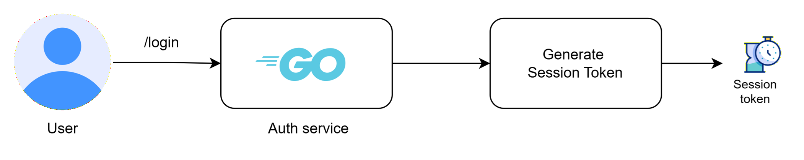
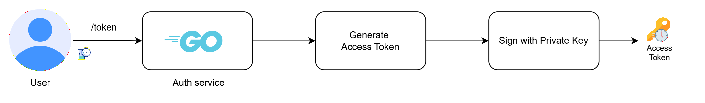
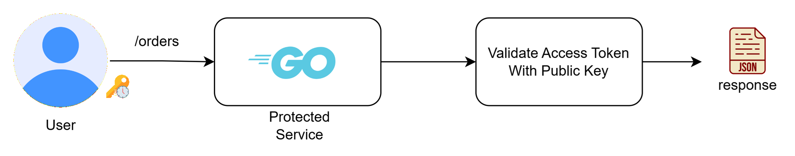
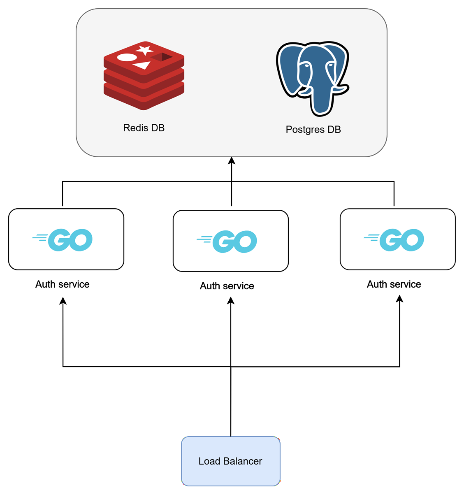
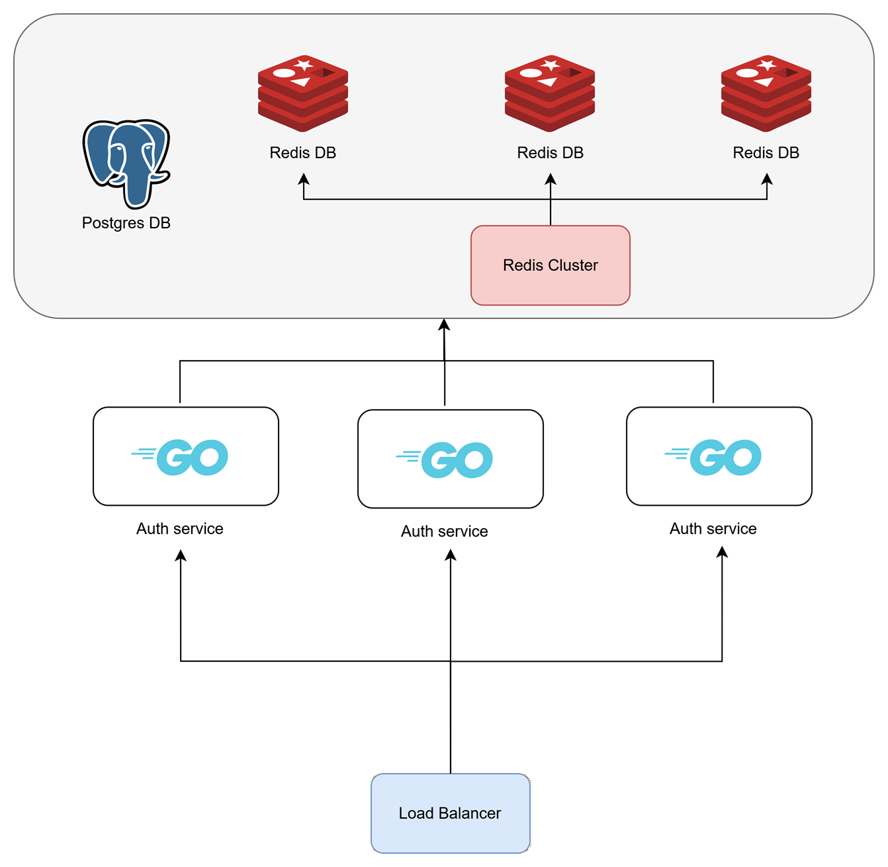

# Docs
In this document it is shown the main design architectural choices for this homework.

# Table of Contents
* [1. Overview](#1-overview)
* [2. Authentication](#2-authentication)
  * [2.1 Session Tokens](#21-session-tokens)
  * [2.2 Access Tokens](#22-access-tokens)
  * [2.3 Additional Notes](#23-additional-notes)
* [3. Data Model](#3-data-model)
* [4. Implementation](#4-implementation)
  * [4.1 Implementation Overview](#41-implementation-overview)
  * [4.2 Go Backend Architecture](#42-go-backend-architecture)
  * [4.3 PostgreSQL](#43-postgresql)
  * [4.4 Redis](#44-redis)
* [5. Request Flow](#5-request-flow)
  * [5.1 Register](#51-register)
  * [5.2 Log In](#52-login)
  * [5.3 Token](#53-token)
  * [5.4 Log Out](#54-logout)
* [6. Security Considerations](#6-security-considerations)
* [7. Current Limitations](#7-current-limitations)
* [8. Scaling up](#8-scaling-up)
 
## [1. Overview](1-overview)

The objective of this assignment is to design and implement an auth service that returns temporary credentials to access protected services.

This project implements a distributed authentication system composed of two independent services:
* **Auth Service**: responsible for user identity management, authentication and temporary credential generation, necessary to access the protected service.
* **Protected Service**: exposes a protected business resource and validates temporary credentials before granting access, without directly managing user credentials.


<div align="center">

</div>

The system follows a microservice-oriented architecture where authentication responsibilities are centralized in the Auth Service, while protected services remain independent and stateless: the protected service can independently validate user credentials without reaching the auth service again.


## [2. Authentication](2-authentication)

Authentication takes place in the auth service. After the users succesfully register and log in, they can ask for access to a specific protected service. They will be granted access to such protected service through temporary credentials.
Such credentials will be verified by the protected service without managing user credentials (such as usernames and passwords), which is responsibility of the auth-service.

For this project, two types of temporary credentials have been implemented to handle the user session:
1. Opaque tokens (session token)
2. JWT tokens (access token)

Opaque tokens are generated and returned to the user after its successful login. They are stateful, and they are characterized by an expiration time. These tokens can be used by the user to generate JWT tokens (access tokens) for a specific service.

The JWT tokens for this project are stateless, so no info about them is stored anywhere, and are designed to have a short time to live. 

### [2.1 Session Tokens](21-session-tokens)
As mentioned, session tokens are opaque tokens generated after the user succesful login. They are stored (hashed) in a database, along with id, user id and expiration time associated.

<div align="center">

</div>
Every time the user asks for a new access token, the auth services checks against the database whether the user session token is valid and not expired. If the session token is expired a 401 status code is sent back. This means that in a real application user should log in to get a new session token.

Session tokens can also be revoked, for example when the user logs out. This updates the *revoked_at* attribute associated to the session.

### [2.2 Access Tokens](22-access-tokens)
Access tokens are JWT stateless tokens: no info about them is stored anywhere. They are characterized by a short time to live, cannot be revoked and they are generated by the auth service when the user asks to access a specific protected service.

<div align="center">

</div>

The auth service generates JWT access tokens and signs them using RSA asymmetric signing (RS256). The token contains standard registered claims used by protected services to validate the authenticity, origin and validity period of the token. If an attacker would change any of the claims, the sign validation would fail.


| Claim                   | Description                                     | Usage                                                                                                    |
| ----------------------- | ----------------------------------------------- | -------------------------------------------------------------------------------------------------------- |
| `iss` (Issuer)          | Identifies the entity that issued the token.    | Used by protected services to verify that the token was generated by the trusted **authentication service**. |
| `sub` (Subject)         | Identifies the entity represented by the token. | Contains the user identifier associated with the authenticated session.                                  |
| `aud` (Audience)        | Identifies the intended recipient of the token. | Ensures that a token generated for a specific service cannot be used against another service.            |
| `exp` (Expiration Time) | Defines when the token becomes invalid.         | Prevents the use of expired access tokens.                                                               |
| `iat` (Issued At)       | Defines when the token was created.             | Provides information about token creation time and helps with token lifecycle management.                |

Example payload:

```json
{
  "iss": "auth-service",
  "sub": "123",
  "aud": [
    "orders-service"
  ],
  "exp": 1750000000,
  "iat": 1749999700
}
```


The protected service validates the token by checking the RSA signature with the **public key** and verifying the registered claims before allowing access to protected resources.

<div align="center">

</div>

If we had multiple services, we would use the same public key for all of them, as sharing a public key is not a security problem as sharing the same private key (this would happen if symmetric signing would be used).


### [2.3 Additional Notes](23-additional-notes)

Using RSA asymmetric cryptography allows protected services to validate JWT access tokens without exposing the private signing key. Unlike symmetric algorithms, where the same secret key must be shared across multiple services, only the public key is distributed. This significantly reduces the impact of a potential key compromise, as protected services are never able to issue valid tokens themselves.

This approach also improves scalability by allowing each protected service to validate access tokens locally. As a result, no additional network calls to the authentication service are required for every protected request, reducing latency and avoiding unnecessary coupling between services.

One trade-off of this design is that a JWT may remain valid for a short period even after the corresponding session has expired or been revoked. In this implementation, access tokens have a short lifetime (5 minutes), limiting this window of exposure. This compromise is common in stateless authentication systems and enables protected services to operate independently while maintaining a high level of security.

## [3. Data Model](3-data-model)
In this section are shown entities and relations involved in the assignment.

### User

Stores user credentials and identity information.

| Column          | Description                                                          |
| --------------- | -------------------------------------------------------------------- |
| `id`            | Unique user identifier.                                              |
| `username`      | Unique username used for authentication.                             |
| `password_hash` | Password hashed using bcrypt. Plain-text passwords are never stored. |
| `created_at`    | Timestamp indicating when the user account was created.              |

---

### Session

Represents an authenticated user session created after a successful login.

| Column               | Description                                                                                                                                          |
| -------------------- | ---------------------------------------------------------------------------------------------------------------------------------------------------- |
| `id`                 | Unique session identifier.                                                                                                                           |
| `user_id`            | Reference to the authenticated user.                                                                                                                 |
| `session_token_hash` | Hash of the session token presented by the client. |
| `created_at`         | Timestamp when the session was created.                                                                                                              |
| `expires_at`         | Session expiration timestamp. Once expired, the session can no longer be used to obtain new access tokens.                                           |
| `revoked_at`         | Optional timestamp indicating that the session has been explicitly revoked before its natural expiration.                                            |

---

Note: in this work the User reference is not used in any way, but for future improvements and extensions it could be very useful, such as adding device_id or extending the whole auth system by managing roles, permissions etc...

### Service Registry

Defines the services that are authorized to receive JWT access tokens from the Authentication Service.

| Column         | Description                                                                                     |
| -------------- | ----------------------------------------------------------------------------------------------- |
| `id`           | Unique service identifier.                                                                      |
| `service_name` | Unique logical name of the service (e.g. `orders-service`).                                     |
| `active`       | Indicates whether the Authentication Service is allowed to issue access tokens for the service. |

The service registry is intentionally simple and static. Its purpose is to prevent access tokens from being issued for arbitrary or unknown services.

The `active` flag represents an authorization rule rather than the runtime health of a service. Whether a service is online or offline is outside the responsibility of the Authentication Service and is therefore not tracked. More advanced service discovery or health monitoring mechanisms were intentionally omitted to keep the project focused on authentication and authorization requirements.

## [4. Implementation](4-implementation)
### [4.1 Implementation Overview](41-implementation-overview)

The system is implemented as a set of independent backend services following a microservice-oriented architecture.


The backend services are developed using **Go**, selected for its suitability in building lightweight and small rest APIs. 
Go provides a simple programming model, efficient resource usage  making it a good fit for authentication services and containerized environments.

The **Authentication Service** is responsible for user management, authentication flows, session handling and JWT access token generation. It uses **PostgreSQL** as the primary persistent datastore for authentication-related information. A relational database was chosen because identity data requires strong consistency guarantees, structured relationships and reliable transactional operations. PostgreSQL represents the system of record for users and service authorization data.

**Redis** is used as a complementary in-memory datastore for session management. Sessions are temporary entities with frequent read operations and a clearly defined expiration lifecycle, making Redis a suitable choice due to its low latency and native TTL capabilities. Redis acts as a cache layer rather than the authoritative datastore, reducing database load while maintaining PostgreSQL as the source of truth.

**Postgres** and **Redis** combined allow us to setup an architecture that guarantees consistent (less frequent) writes (Postgres ACID transactions) and fast, more frequent reads (Redis in-memory db).

The **Protected Service**, implemented in Go, validates JWT access tokens independently and exposes protected business resources. This service uses **MongoDB** as its persistence layer for order data. MongoDB was selected because order information naturally fits a document-oriented model, allowing related data such as customer snapshots and order details to be stored together. In this implementation MongoDB is used mainly as a mock business datastore to demonstrate the interaction between authentication and protected resources, rather than representing a complex domain persistence layer.

All components are containerized using **Docker**, allowing each service and its dependencies to run in isolated environments while maintaining a reproducible deployment process. This approach reflects common practices used in distributed systems, where services can be developed, deployed and scaled independently.

## [4.2 Go Backend Architecture](#42-go-backend-architecture)
From a software engineering perspective, Go encourages a simple and explicit programming model. The language favors composition over inheritance, has a relatively small standard library with extensive networking support, and integrates naturally with dependency injection through interfaces. These characteristics contribute to codebases that are easier to maintain, test and evolve.

The backend follows a layered architecture based on the Repository Pattern, separating HTTP handling, business logic and persistence concerns into distinct layers. This separation promotes loose coupling between components, improves unit testability through interface-based mocking, and allows infrastructure details—such as PostgreSQL, Redis or future storage technologies—to evolve independently from the business logic.

The backend services are implemented in Go following a layered architecture based on the **Repository Pattern**.

The main goal of this design is to separate business logic from data access concerns, allowing each layer to have a clear responsibility and making the system easier to maintain and test.

The implemented structure can be summarized as follows:

```text
HTTP Request
      |
      v
+-------------+
|  Handlers   |
+-------------+
      |
      v
+-------------+
|  Services   |
+-------------+
      |
      v
+-------------+
| Repository  |
+-------------+
      |
      v
+-------------+
| Persistence |
+-------------+
```

The **handler layer** is responsible for HTTP concerns, including request parsing, input validation and response generation. It does not directly interact with databases or external systems.

The **service layer** contains the application logic. It coordinates operations such as user registration, authentication, session creation and JWT generation, without being coupled to a specific persistence implementation.

The **repository layer** abstracts all interactions with external storage systems. Repositories expose domain-oriented operations instead of database-specific queries, allowing the underlying storage technology to be replaced or mocked during testing.

This approach provides several advantages:

* clear separation of responsibilities;
* improved testability through dependency injection and repository mocking;
* reduced coupling between business logic and infrastructure components;
* easier evolution of the system as new storage requirements are introduced.

---

## [4.3 PostgreSQL](43-postgresql)
  
PostgreSQL is used as the authoritative datastore for authentication data. Since the Authentication Service is responsible for issuing credentials that grant access to protected resources, correctness and consistency take priority over raw scalability. For this reason, a relational database with strong ACID guarantees represents a suitable choice.

Authentication data naturally forms a relational domain: users own sessions, services are registered and authorized, and future extensions may introduce concepts such as roles, permissions or groups. PostgreSQL provides native mechanisms such as foreign keys, unique constraints and transactional guarantees to enforce these relationships directly at the database level, reducing the amount of consistency logic required in the application.

By contrast, while NoSQL databases such as MongoDB excel at horizontal scalability and flexible schemas, maintaining complex relationships often relies more heavily on application logic. As the domain evolves, ensuring referential integrity and coordinating related updates becomes the responsibility of the backend rather than the database itself.

The relational model therefore provides a more robust foundation for authentication and authorization data, where preserving integrity is generally more important than maximizing write scalability. NoSQL databases remain an excellent choice for other domains—such as document-oriented business data—where schema flexibility and horizontal scaling are the primary concerns rather than strict relational consistency.

Below are shown the main entities modeled in Postgres.

### Users

The `users` table stores identity information.

| Column          | Description                                   |
| --------------- | --------------------------------------------- |
| `id`            | Primary key identifying the user.             |
| `username`      | Unique identifier used during authentication. |
| `password_hash` | Securely hashed password using bcrypt.        |
| `created_at`    | Account creation timestamp.                   |

The username field is protected by a unique constraint to prevent multiple accounts with the same identity.

Passwords are never stored in plain text. Only the result of the hashing function is persisted, ensuring that database exposure does not directly reveal user credentials.

---

### Sessions

The session table stores persistent information about authenticated sessions.

| Column               | Description                                              |
| -------------------- | -------------------------------------------------------- |
| `id`                 | Primary key of the session record.                       |
| `user_id`            | Foreign key referencing the authenticated user.          |
| `session_token_hash` | Hash of the session token stored for security reasons.   |
| `created_at`         | Session creation timestamp.                              |
| `expires_at`         | Session expiration timestamp.                            |
| `revoked_at`         | Optional timestamp used for explicit session revocation. |

The relationship between users and sessions is modeled through a foreign key constraint, ensuring that sessions cannot exist without a valid user.

PostgreSQL remains the system of record for sessions, while Redis is used as a performance optimization layer.

---


### Service Registry

The service registry stores the list of services allowed to receive JWT access tokens.

| Column         | Description                                              |
| -------------- | -------------------------------------------------------- |
| `id`           | Primary key.                                             |
| `service_name` | Unique service identifier used as JWT audience.          |
| `active`       | Indicates whether token generation is currently allowed. |

The registry is intentionally simple and does not represent runtime service discovery. The purpose of this table is authorization control: the Authentication Service only issues tokens for registered and active services.

---

### Indexes

Indexes are used to optimize the most frequent lookup operations performed by the Authentication Service. Since most queries are based on exact matching conditions (for example, searching a user by username or retrieving a session by its token hash), PostgreSQL B-indexes are used.

The following indexes are defined:

| Table              | Column               |  Purpose                                                                                                                 |
| ------------------ | -------------------- | ------------------------------------------------------------------------------------------------------------------------ |
| `users`            | `username`           | Usernames are unique: this index provides efficient user lookup during log in.                           |
| `sessions`         | `session_token_hash` | Allows efficient session retrieval, useful whenever a user asks for a new access token and its session token must be validated.  |
| `service_registry` | `service_name`       | Allows fast service lookup during access token JWT audience validation and prevents duplicate service registrations.                  |

PostgreSQL automatically creates a unique B-tree index for columns defined with a `UNIQUE` constraint. This is particularly useful for authentication data, where most queries are equality-based lookups rather than range queries.

The `session_token_hash` index is especially important because session validation requires retrieving a session using a deterministic hash value generated from the client-provided session token. Storing and indexing the hash instead of the raw token improves security while maintaining efficient lookup performance.


### [4.4 Redis](44-redis)

Redis is used as a high-performance cache layer for session retrieval.

Sessions are accessed frequently during authentication flows, especially when exchanging a session token for a JWT access token. Performing every lookup directly against PostgreSQL would introduce unnecessary database load and latency.

Redis is therefore used following a cache-aside strategy, while PostgreSQL remains the source of truth.

### Session Key Design

Session entries are stored using a deterministic key format:

```text
session:<session_token_hash>=<user_id>
```

The session token hash is used instead of the raw token to avoid storing sensitive authentication material directly.

Example:

```text
session:a8f91c2d7e4b... = 123
```

Keeping the cached object small reduces memory usage and improves lookup efficiency.

---

### Session TTL Strategy

Each Redis session key is created with a TTL matching the configured session lifetime.

Example:

```text
SET session:<token> <data> EX 86400
```

Using Redis native expiration provides several benefits:

* automatic removal of expired sessions;
* no background cleanup process required;
* reduced application complexity;
* predictable memory usage.

The TTL represents the maximum lifetime of the authenticated session, while JWT access tokens have a shorter lifetime. This separation allows short-lived stateless access tokens while maintaining a longer authenticated session.

---

### Service Registry Cache

Service registry information is also suitable for caching because it changes infrequently compared to how often it is read.

The chosen key format is the following:

```text
service:<service_name> = <active>
```

Example:

```text
service:orders-service = true
```

This avoids repeated database lookups during token generation while keeping PostgreSQL as the authoritative source.

Because service registration changes are administrative operations rather than runtime events, cache invalidation can be handled explicitly when services are added, removed or disabled.

## [5. Request Flow](5-request-flow)
In this section it is explained the request flow, showing which services act and how.

In such flows we want to obtain in general consistent writes, and fast reads, exploiting SQL transactions for critical but sporadic write operations, while fast reads in cache for frequent operations.

### [5.1 Register](51-register)
Registration is very simple: the user chooses a username/password pair and sends it to the auth service, which tries to save into user table. 
If success, a success response is sent to the user.

<div align="center">

</div>

### [5.2 Log In](52-login)
In the log in we exploit SQL transaction to ensure consistency: when the user succesfully logs in, a session token is generated and it is saved in postgres session table. If such operation completes succesfully, the session token is returned to the user while being saved in redis cache for faster access (with a TTL equal to the life of the session token), when for example creating short lived tokens, which is by definition a much frequent operation.
If the insert in postgres fails, the whole operation rolls back, returning an error message to the user, to ensure consistency.

<div align="center">

</div>

### [5.3 Token](53-token)
In this request the user asks for an access token, which allows it to access a specific protected service.
First, its session token and service names must be validated: first, they are searched in the Redis database, if they're not available they are searched in the postgres db (service names are found in the service registry table, while session tokens in the session table) the auth service generates an access token which is returned to the user. 
If any information was found in postgres but not in redis, it is also copied in redis cache while the access token is returned to the user, for faster reads in the future.
If session token/service name is not valid, obviously, an error is returned.


### [5.4 Log Out](54-logout)
When logging out the field revoked_at in session table in postgres is updated and the session token is removed from redis cache.

<div align="center">

</div>

## [6. Security Considerations](6-security-considerations)

Security has been one of the primary design objectives, even though the time constraints, throughout the implementation of the authentication platform. The following measures have been adopted to protect user credentials, authentication sessions and access tokens while keeping the architecture suitable for a distributed microservice environment.

### Password Hashing

User passwords are never stored in plain text. During registration, each password is hashed using **bcrypt** before being persisted in User table in PostgreSQL db.


### Session Tokens Hashing

Session tokens are generated using a cryptographically secure random generator and are never stored directly in persistent storage.

Before being persisted, each session token is hashed using SHA-256. Consequently, both PostgreSQL and Redis contain only the hash of the token rather than the token itself.

### RSA-Signed JWT Access Tokens

JWT access tokens are signed using the RSA asymmetric algorithm (RS256).

The private signing key remains exclusively within the Authentication Service, while only the corresponding public key is distributed to protected services for signature verification.

This architecture provides two important advantages:

* protected services are able to validate JWTs locally without contacting the Authentication Service;
* protected services cannot issue new access tokens because they never possess the private signing key;
* protected services do not manage user credentials.

Using asymmetric cryptography therefore improves both scalability and security in comparison with symmetric signing algorithms, where the same secret key would need to be shared across multiple services.


### Short-Lived Access Tokens

JWT access tokens are intentionally configured with a short lifetime (5 minutes).

Once issued, a JWT remains valid until its expiration time, even if the corresponding session is revoked shortly afterwards. This is an inherent characteristic of stateless JWT authentication.

Limiting the token lifetime significantly reduces this exposure window while allowing protected services to validate requests independently, without introducing synchronous communication with the Authentication Service and without storing JWT tokens in the database as it's been done with the session tokens.


### Standard JWT Claims

Each generated JWT includes the standard registered claims defined by RFC 7519.

Protected services validate these claims before granting access to protected resources: any attempt by a hacker to change issuer/subject/expiry would make the validation fail.


### Service Authorization

The Authentication Service maintains a service registry containing the list of services authorized to receive JWT access tokens.

Access tokens are generated only for registered and active services, preventing arbitrary audience values from being embedded into JWTs.

This mechanism reduces the risk of token misuse across unauthorized services.


### Secure Key Management

RSA key pairs are generated outside the application during deployment.

The private key is accessible only by the Authentication Service, while the public key is distributed to protected services for verification purposes.

Separating signing and verification keys minimizes the impact of a compromise affecting a protected service, as attackers would still be unable to generate valid JWTs.


### Transport Security

The current implementation communicates over HTTP for simplicity and ease of local development.

In a production environment, all communication between clients and services, as well as inter-service communication, should be protected using HTTPS/TLS.

Without transport encryption, authentication credentials, session tokens and JWT access tokens could be intercepted by an attacker performing network-level attacks.


## [7. Current Limitations](7-current-limitations)

The current implementation intentionally focuses on demonstrating a complete authentication workflow while keeping the overall architecture simple. As a result, several limitations remain that would need to be addressed in a production-grade system.

### Session Delete Policy
In this work, sessions are stored in the relational database indefinetely, making the session table grow very rapidly. 
Since no specific use of old sessions has been defined, a delete policy could be considerated, for example running a cron job that deletes sessions older than 30 days, for example, or moving such sessions into another table used as archive.

### JWT Revocation Delay

JWT access tokens are stateless and are therefore not validated against the Authentication Service once issued.

As a consequence, revoking or expiring a user session does not immediately invalidate already issued access tokens. A JWT remains valid until its expiration time.

This limitation is partially mitigated by keeping the access token lifetime intentionally short (5 minutes), reducing the exposure window while preserving the scalability benefits of local JWT validation.

### Protected Service Design
This work had the main focus on the development of an authorization system that could access a protected service. For this reason, a great part of the effort went to such auth service, while giving a protected service the role of a mock service, with no particular effort on design, scalability and technology considerations. Anything further would go beyond the scope of this work.


### No Automatic Service Registry Synchronization

The service registry is stored in PostgreSQL and represents the list of services authorized to receive JWT access tokens.

Any changes to the registry are performed manually. The current implementation does not include automatic synchronization, dynamic service discovery or integration with orchestration platforms.

This simplification was considered acceptable for the scope of the project.

### No Refresh Token Mechanism

Clients authenticate again whenever the session is used to obtain a new JWT access token.

Although this keeps the authentication flow simple, production systems commonly introduce refresh tokens to improve user experience while maintaining short-lived access tokens.

### Limited Session Management

The current implementation supports session expiration and revocation but does not provide advanced session management capabilities such as:

* multiple concurrent session management;
* device identification;
* session history;
* forced logout of specific devices;
* user session inspection.

These features could be added without requiring major architectural changes.

### Key Management

RSA keys are generated locally and loaded from the filesystem.

Although sufficient for development purposes, production deployments should store private keys inside a dedicated secret management solution such as HashiCorp Vault or a cloud-based Key Management Service (KMS).

Key rotation is also not currently implemented.

### No API Gateway

For simplicity, each service is directly exposed through its own HTTP port.

This approach facilitates local development, testing and API inspection, allowing individual services to be accessed independently without introducing additional infrastructure components.

In a production environment, however, a dedicated API Gateway or reverse proxy such as NGINX should be integrated.
### Transport Security

Communication currently occurs over HTTP to simplify local development.

In a production deployment, HTTPS/TLS should be mandatory for both client-to-service and inter-service communication in order to protect credentials and authentication tokens during transmission.

## [8. Scaling up](#8-scaling-up)

The proposed architecture can provide good performance when the number of active users—who request a new access token approximately every five minutes—is moderate. As the number of active users grows, the authentication service can be horizontally scaled by deploying multiple stateless instances behind a load balancer.

During a token refresh operation, the client sends its session token to the authentication service, which validates it by querying Redis. In the common case, the session information is retrieved directly from Redis, avoiding access to PostgreSQL and significantly reducing latency.

Initially, all authentication service instances can share the same Redis and Postgres deployment:

<div align="center">
 
</div>

If Redis itself becomes a bottleneck due to increasing request throughput or memory consumption, it can be horizontally scaled by deploying a Redis Cluster. In this case, sharding the data based on the session token hash evenly distributes both the storage requirements and the request load across the cluster nodes, making it a suitable strategy for scaling the cache layer.

<div align="center">

</div>

The relational database is intentionally designed around a single PostgreSQL primary instance.

The majority of authentication requests are expected to be served directly from Redis, with PostgreSQL being accessed only during session creation, cache misses or administrative operations. As a result, introducing multiple database instances would provide limited performance improvements while significantly increasing architectural complexity.

Sharding the authentication database would also offer little benefit. Authentication data forms a strongly consistent domain where users, sessions and service registrations are closely related. Distributing this data across multiple shards would complicate transactional operations and consistency management without substantially reducing the load on the primary database.

For this reason, the best solution for scaling up would be to increase the number of application instances, create a Redis cluster while keeping Postgres db in a single instance.

This would guarantee what we wanted to achieve so far: consistent writes, fast reads.
